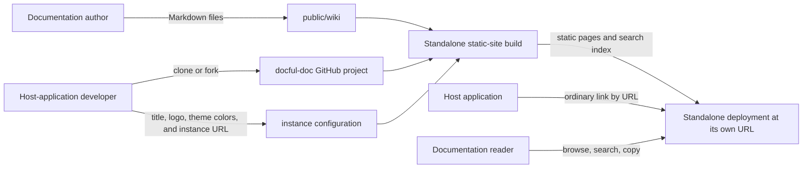

# System Architecture

> The architecture proposals in this document have been approved. Each host-application developer clones or forks the project and manages their instance's configuration and deployment. Instances support both hostname-root and configurable path-prefix deployments.

## Purpose and scope

Provide a standalone documentation website built from Markdown files under `public/wiki`. It has its own URL, deployment, configuration, and release lifecycle. The web application it documents links to that URL; it does not install, import, embed, or run docful-doc as a component.

The output is a statically generated Astro website hosted on Vercel. It does not require an application server, database, or hosted search service for the documented requirements.

## Context

### Users and external systems

| Actor or system | Relationship to this system |
| --- | --- |
| Host-application developer / site creator | Clones or forks the project, sets title, logo, and theme colors, chooses the instance URL or path prefix, and deploys the instance |
| Documentation author | Adds and edits Markdown files under `public/wiki` in the docful-doc source repository |
| Documentation reader | Opens the standalone URL to browse, search, copy wiki content, and choose an appearance mode |
| Host application | Links to the standalone docful-doc URL; it has no runtime integration with the docful-doc application |
| GitHub project | Provides the starter source that each host-application developer clones or forks |
| Build and static hosting platform | Builds the developer's standalone instance and serves generated pages and assets |

### Context diagram

## Components

| Component | Responsibility | Interfaces |
| --- | --- | --- |
| Markdown content collection | Discovers files recursively, parses YAML frontmatter, validates required metadata, and supplies page content and folder hierarchy | Astro content collection with a local glob loader rooted at `public/wiki` |
| Static page generator | Generates a page route for each Markdown file, shared site layout, navigation tree, in-page table of contents, and static assets | Astro static build output with configurable base path |
| Search index generator | Extracts title, heading, body text, and last-updated timestamp; generates data for full-text search | Static JSON index emitted during the site build |
| Wiki interface | Renders branding, page hierarchy, collapsible navigation, search results, page metadata, copy controls, a theme-picker menu, and in-page section navigation | Standalone Astro pages with small client-side TypeScript modules for interactive behavior |
| Markdown renderer | Renders CommonMark and approved GFM features without raw HTML | Astro Markdown pipeline with configured remark/rehype plugins and sanitization |
| Static host/CDN | Serves the compiled documentation website at its own URL | Vercel static deployment; HTTP(S) requests only |

## Key data and flows

1. The host-application developer clones or forks the GitHub project. The site creator configures the instance's title, logo, primary and secondary theme colors, and deployment base (`/` for hostname-root hosting or a prefix such as `/docs/`). Documentation authors maintain its Markdown files under `public/wiki`, where folder paths define page hierarchy.
2. The standalone site's build reads the content collection from `public/wiki`, validates frontmatter, captures each file's filesystem modification timestamp, generates one static page per Markdown file, and produces the navigation tree, heading anchors, in-page table of contents, and search-index data.
3. The static build is deployed independently. It can be served from the root of a dedicated hostname or under a path prefix. For path-prefix hosting, the host application's routing layer forwards requests for that prefix to the standalone deployment; the application itself still links to the URL normally.
4. A reader opens a generated page directly or uses the navigation tree. The selected page and its in-page table of contents are already delivered as static HTML, so the core content and section links work without client-side application hydration.
5. Search loads its generated index in the browser when needed. Results follow the PRD's match-field priority, most-recent-first ordering within each priority, and excerpt behavior.
6. Navigation collapse, search interaction, clipboard copy, and appearance selection use browser-side TypeScript. The header's theme-picker button opens a menu for Light, Dark, and System modes. System defaults to the reader's `prefers-color-scheme`; an explicit Light or Dark choice is saved in local storage for that browser. Page timestamps are formatted in the reader's local timezone with the timezone shown.

The site and its Markdown, generated HTML, logo, and search index are public. The host application does not send user data or documentation requests to docful-doc beyond the reader's normal page visit.

## Approved technology choices

| Area | Approved choice | Reason / constraint |
| --- | --- | --- |
| Site framework | Astro in static output mode | Suits a standalone, content-heavy site: Markdown collections can be schema-validated and pages generated at build time as static routes |
| Language | TypeScript for site configuration and interactive browser modules | Type checking for content metadata, navigation, and search data |
| Content source | Astro content collection using a glob loader rooted at `public/wiki` | Preserves the PRD's required content location while providing frontmatter schema validation and generated types |
| Deployment base | Astro's `base` configuration set to `/` for hostname-root hosting or the selected prefix, such as `/docs/` | Ensures generated routes and assets use the correct deployment prefix |
| Markdown | Astro's Markdown pipeline with the approved GFM features; raw HTML remains disabled and output is sanitized | Uses Markdown-native content processing and meets the PRD's rendering and security constraints |
| Search | MiniSearch in a small browser-side TypeScript module, backed by generated index data | Keeps the experience local and avoids a search service; docful-doc applies the approved match-tier and recency ordering |
| Interactive behavior | Native browser APIs and small TypeScript modules; no React integration | Collapse, search, and copy are limited client interactions; pre-rendered wiki content stays available without hydrating a React application |
| Styling | Responsive CSS with documented CSS custom properties for site branding and primary/secondary theme colors, plus light and dark color schemes | Keeps desktop, tablet, and mobile layouts under docful-doc's control; System follows `prefers-color-scheme`, and each scheme maintains WCAG 2.2 AA contrast with configured colors; the in-page table of contents sits alongside content on desktop and tablet and remains accessible on mobile |
| Hosting | Vercel static deployment connected to the GitHub repository | Supports static output, Git-triggered production and preview deployments, and optional custom domains; no server-side rendering or Vercel functions are needed for this site |
| Validation | Build-time content schema validation; unit tests for indexing/ranking; browser tests for navigation, search, copy, and responsive behavior | Validates content and user-visible requirements without host-application integration tests |

Astro's official documentation supports Markdown and YAML frontmatter, typed content collections with schemas, static route generation, and client-side integrations when needed. Its default static output fits an independently hosted documentation site. Its local `glob()` loader accepts a configured content base, so the collection can read from the required `public/wiki` directory without moving the author-facing content. [Astro Markdown](https://docs.astro.build/en/guides/markdown-content/), [Astro content collections](https://docs.astro.build/en/guides/content-collections/), [Astro static rendering](https://docs.astro.build/en/guides/on-demand-rendering/)

Vercel supports deploying a static Astro site without an adapter or server functions, and its Git integration provides automatic production deployments and preview URLs. The approved URL strategy is to use the generated `*.vercel.app` URL initially, then add a `docs` subdomain under the host application's domain if the owner controls its DNS. [Astro on Vercel](https://vercel.com/docs/frameworks/frontend/astro), [Git deployments and previews](https://vercel.com/docs/git), [Custom domains](https://vercel.com/docs/domains/working-with-domains/add-a-domain)

MiniSearch supports in-memory full-text search in browsers and Node.js. Its relevance score alone does not enforce docful-doc's exact result tiers, so the site must apply those ordering rules after matching. [MiniSearch](https://github.com/lucaong/minisearch)

## Cross-cutting requirements

### Security and privacy

- Treat Markdown and frontmatter as untrusted input.
- Do not render raw HTML from Markdown. Sanitize generated output and restrict link and image URL protocols.
- Escape title and author as text; do not interpolate frontmatter values into raw HTML.
- Treat all files under `public/wiki` and the generated index as public. Never include credentials or private content there.
- User accounts, analytics, backend APIs, and remote search services are outside the approved architecture.

### Reliability and operations

- Build fails with a file-specific diagnostic when a Markdown file cannot be parsed or lacks required `title` metadata.
- Static routes keep already-built wiki content readable when JavaScript is unavailable; search and copy controls require browser scripting.
- CSS uses the system color scheme as the initial System appearance so the page has a usable scheme before browser-side preference restoration; explicit reader choices are restored from local storage.
- Missing or invalid search data displays an understandable search error without hiding page content.
- Site configuration, build, and deployment belong to docful-doc's repository and can be released independently of the host application.
- In path-prefix mode, the host application's routing layer must forward the configured prefix to the Vercel deployment.

### Performance and scale

- Use the approved benchmark corpus: baseline 500 pages / 5 MB searchable text; stress 2,000 pages / 20 MB; maximum folder depth five.
- Pre-render page content and load search data only when the reader starts a search.
- Keep interactive JavaScript limited to navigation, search, and copy behavior.
- Measure the approved Core Web Vitals and search-response targets using the approved benchmark conditions in the PRD.

### Accessibility and compatibility

- Use semantic navigation, main, heading, and form elements; support keyboard use and visible focus.
- Render the in-page table of contents as a labeled navigation landmark with links that follow the page's heading hierarchy; use stable heading IDs for section anchors.
- Expose navigation expanded/collapsed state and search updates to assistive technology.
- Implement the theme picker as a keyboard-accessible header button and menu with its selected mode exposed to assistive technology; keep focus indicators and contrast clear in both schemes.
- Preserve logical focus when the mobile navigation opens or closes.
- Meet WCAG 2.2 AA in light and dark schemes and support desktop, tablet, and mobile layouts.
- Validate supported Chrome, Edge, Firefox, and Safari releases using browser tests against the standalone site.

## Architectural decisions

| Decision | Status | Rationale / record |
| --- | --- | --- |
| Create one standalone instance per host application by cloning or forking the GitHub project; the host app links to the instance URL | Accepted | Clarification in the PRD; the host-app developer owns configuration and deployment; no component embedding or runtime integration |
| Support both hostname-root and configurable path-prefix deployments | Accepted | Configure Astro's base path; the host application's routing layer forwards requests when the instance uses a prefix |
| Use a static site generated from Markdown content | Accepted | Public documentation is mostly static and benefits from direct page URLs without a required server |
| Use Astro content collections and static output | Accepted | Provides Markdown/frontmatter handling, schema validation, static routes, and limited client-side behavior |
| Use TypeScript with native browser modules for interactions; do not integrate React | Accepted | Keeps the standalone site independent of the host application framework and limits client-side code |
| Use MiniSearch for local full-text matching | Accepted | Avoids a search service for the approved corpus; explicit PRD ranking rules are applied by docful-doc |
| Use Astro's Markdown pipeline with the approved GFM features and sanitized output; disable raw HTML | Accepted | Matches the PRD's Markdown contract and rendering constraints |
| Use responsive CSS with documented branding variables | Accepted | Supports desktop, tablet, and mobile layouts with site-level visual customization |
| Offer Light, Dark, and System reader appearance modes; default to System | Accepted | System follows the browser/device `prefers-color-scheme`; explicitly selected Light or Dark is stored in browser local storage |
| Validate content during build and cover logic and browser behavior with unit and browser tests | Accepted | Checks source content and user-visible requirements in the standalone site |
| Use filesystem modification time for each page's update timestamp | Accepted | Capture the filesystem timestamp during the build and serialize it as an absolute time; display it in the reader's local timezone. Do not fall back to Git history. |
| Use Vercel static hosting with Git integration | Accepted | Vercel supports static Astro sites and automatic preview deployments |
| Let each instance owner choose its Vercel URL; use a `docs` custom subdomain if available | Accepted | Each host-app developer owns their instance; a custom subdomain gives a branded URL when DNS is available |

## Constraints and open questions

### Constraints

- The documentation source is Markdown under `public/wiki` with required `title` and optional `author` frontmatter.
- The host application links to docful-doc by URL and does not integrate it as an application component.
- All wiki content is public.
- Search, timestamp presentation, responsiveness, and performance benchmark follow the PRD.

### Open questions
