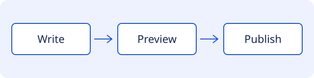

Markdown images can illustrate documentation. This example uses an asset stored with the repository so it works without a remote image service.

## Local illustration

The diagram summarizes a fictional workflow: write a page, preview its rendering, then publish it through the site's normal deployment process.

## Alternative text

Describe the information the reader needs from an image. For this diagram, the alternative text names the three steps in their order.

An image that conveys instructions should also have enough surrounding text for readers who cannot see it.

## Asset paths

The source asset is `public/examples/documentation-flow.svg`. The relative image path is resolved from this Markdown file during the build. Astro emits the image asset with the configured hosting prefix.

## Try it

Open this page in Light and Dark modes and at a narrow width. The illustration should stay legible and fit within the article.
